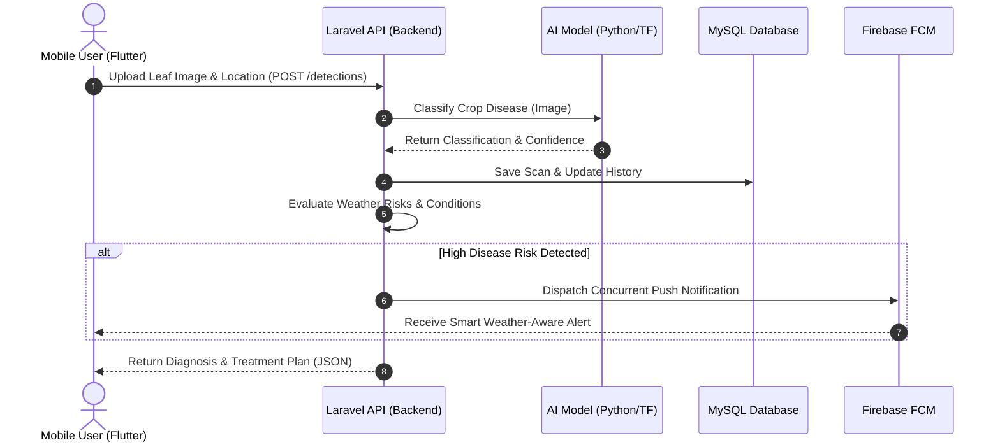
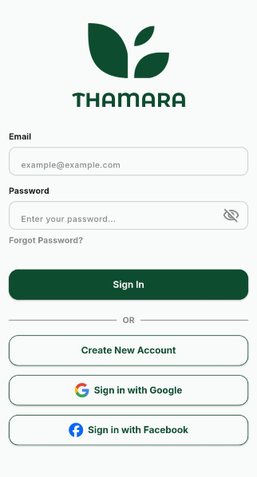
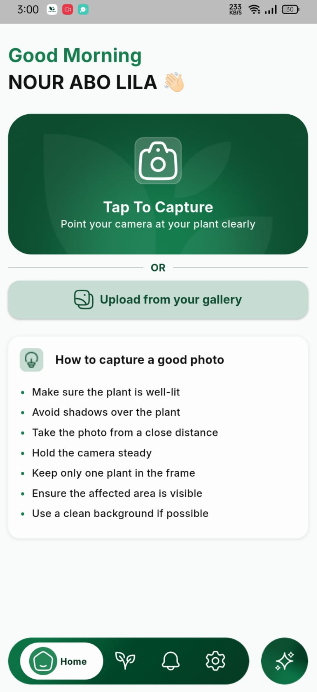
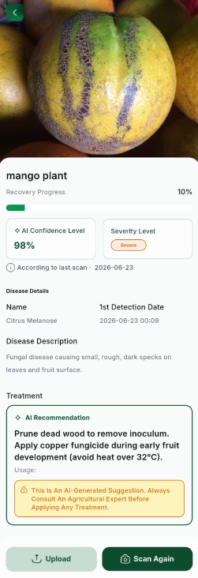
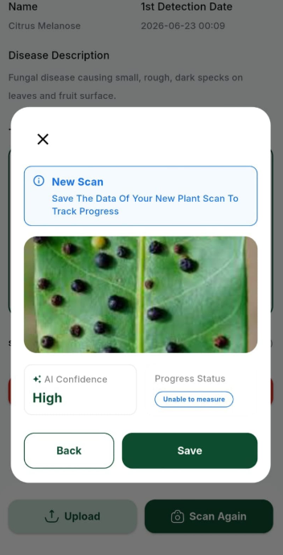
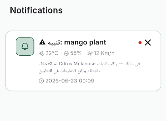
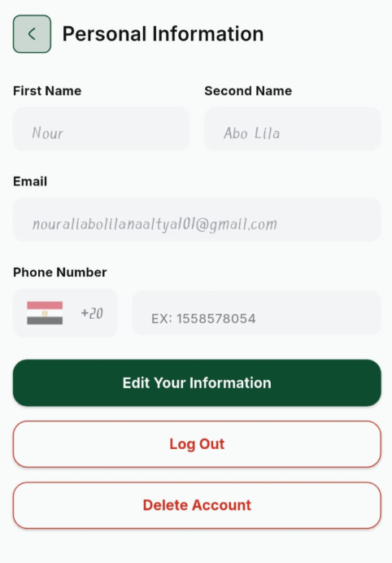
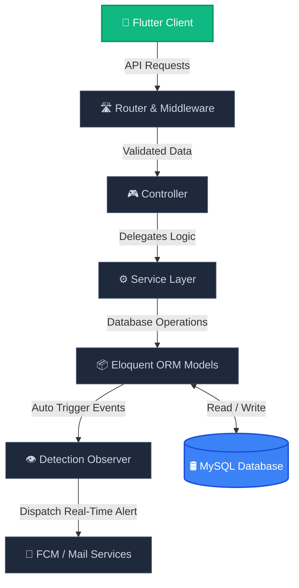
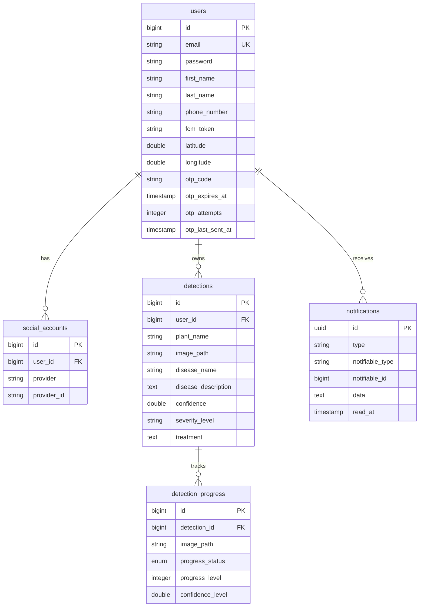

<p align="center">
  
</p>

<p align="center">
  
</p>

<p align="center">
  <strong>An AI-powered mobile backend application that helps users detect plant diseases, monitor plant recovery progress over time, and receive smart, location-specific, weather-based agricultural recommendations.</strong>
</p>

<p align="center">
  <a href="https://laravel.com"></a>
  <a href="https://php.net"></a>
  <a href="https://mysql.com"></a>
  <a href="https://firebase.google.com"></a>
  <a href="https://opensource.org/licenses/MIT"></a>
</p>

<p align="center">
  
  
  
  
</p>

---

## 🌟 Project Overview

* 🌿 **AI-Powered Diagnostics:** A RESTful API that handles plant image uploads to return immediate crop disease classification and treatments.
* 🌤️ **Weather-Aware Risk Engine:** Evaluates micro-climates using geolocation weather forecasts (humidity, temp, precipitation) to predict active spread risks.
* 📈 **Recovery Scan Logs:** Tracks progressive plant scan records to monitor healing statuses (*Healed, Improving, Stable, Worsening*).
* ⚡ **High-Throughput Architecture:** Asynchronous SMTP email dispatches and concurrent FCM HTTP/2 notification queues ensure fast API cycles.
* 🔒 **Hardened Core Security:** Multi-layered security including brute-force OTP lockouts, token authentication, rate limiters, and mass-assignment whitelists.

---

## 🚀 Key Features

<table width="100%">
  <tr>
    <td width="50%" valign="top">
      <h3>🔐 Secure Authentication</h3>
      <ul>
        <li>Robust email and password verification via Sanctum Bearer tokens.</li>
        <li>Automatic whitelisted input validation to prevent SQL/noSQL injection vectors.</li>
      </ul>
    </td>
    <td width="50%" valign="top">
      <h3>📧 Email Verification & OTP</h3>
      <ul>
        <li>Hashed OTP verification codes with auto-invalidation after 10 minutes.</li>
        <li>2-minute resend cooldown and 5-attempt brute-force lockouts.</li>
      </ul>
    </td>
  </tr>
  <tr>
    <td width="50%" valign="top">
      <h3>🌍 Google OAuth2</h3>
      <ul>
        <li>Stateless Socialite integration for seamless, quick mobile client sign-in.</li>
        <li>Automatic user database provisioning on first-time login attempts.</li>
      </ul>
    </td>
    <td width="50%" valign="top">
      <h3>🤖 AI Plant Disease Detection</h3>
      <ul>
        <li>Multipart image upload handler mapping citrus & mango pathogens.</li>
        <li>Instant responses including disease classification, accuracy, and treatment.</li>
      </ul>
    </td>
  </tr>
  <tr>
    <td width="50%" valign="top">
      <h3>📊 Detection Progress Tracking</h3>
      <ul>
        <li>Logs chronological scans for a single affected plant.</li>
        <li>Tracks states: <i>Healed, Improving, Stable, Worsening</i> with progress rates.</li>
      </ul>
    </td>
    <td width="50%" valign="top">
      <h3>🔔 Firebase Push Notifications</h3>
      <ul>
        <li>Sends real-time FCM push notifications to devices on risk detection.</li>
        <li>Utilizes HTTP/2 client concurrency pools for fast broadcast routing.</li>
      </ul>
    </td>
  </tr>
  <tr>
    <td width="50%" valign="top">
      <h3>🌦️ Geolocation & Weather Insights</h3>
      <ul>
        <li>Retrieves local weather parameters based on latitude and longitude coordinates.</li>
        <li>Evaluates risk indexes for temperature, humidity, wind, and precipitation.</li>
      </ul>
    </td>
    <td width="50%" valign="top">
      <h3>🔥 Decoupled Event Listeners</h3>
      <ul>
        <li>Uses Laravel Observers connected to model lifecycle operations.</li>
        <li>Triggers weather lookups and notification dispatches asynchronously.</li>
      </ul>
    </td>
  </tr>
</table>

---

## 🔄 Application Workflow



---

## 📱 Screenshots & Mockups

<table width="100%">
  <tr>
    <td width="33%" align="center">
      <strong>🔐 Authentication</strong><br/><br/>
      
    </td>
     <td width="33%" align="center">
      <strong>🔐 Home padge</strong><br/><br/>
      
    </td>
    <td width="33%" align="center">
      <strong>🤖 AI Detection</strong><br/><br/>
      
    </td>
  </tr>
  <tr>
  <td width="33%" align="center">
      <strong>📈 Progress Tracking</strong><br/><br/>
      
    </td>
    <td width="33%" align="center">
      <strong>🔔 Smart Alerts & 🌦️ Weather Insights</strong><br/><br/>
      
    </td>
    <td width="33%" align="center">
      <strong>👨‍💼 User Profile</strong><br/><br/>
      
    </td>
  </tr>
</table>

---

## 🛠️ Tech Stack

<p align="center">
  <a href="https://skillicons.dev">
    
  </a>
</p>

---

## 🏛️ Backend Architecture



---

## 📊 Database Architecture



---

## 🔌 API Design

<table>
  <thead>
    <tr>
      <th>Module</th>
      <th>Method</th>
      <th>Endpoint</th>
      <th>Auth</th>
      <th>Description</th>
    </tr>
  </thead>
  <tbody>
    <tr>
      <td rowspan="4"><b>🔐 Auth</b></td>
      <td><kbd>POST</kbd></td>
      <td><code>/api/auth/register</code></td>
      <td>❌</td>
      <td>Register user &amp; dispatch verification OTP</td>
    </tr>
    <tr>
      <td><kbd>POST</kbd></td>
      <td><code>/api/auth/verify-otp</code></td>
      <td>❌</td>
      <td>Verify OTP &amp; receive Sanctum Bearer token</td>
    </tr>
    <tr>
      <td><kbd>POST</kbd></td>
      <td><code>/api/auth/social-login</code></td>
      <td>❌</td>
      <td>Stateless Social Login via Google / Facebook</td>
    </tr>
    <tr>
      <td><kbd>POST</kbd></td>
      <td><code>/api/auth/logout</code></td>
      <td>✔️</td>
      <td>Revoke the current user access token</td>
    </tr>
    <tr>
      <td rowspan="2"><b>🌱 Detection</b></td>
      <td><kbd>POST</kbd></td>
      <td><code>/api/detections</code></td>
      <td>✔️</td>
      <td>Upload leaf image &amp; get classification</td>
    </tr>
    <tr>
      <td><kbd>GET</kbd></td>
      <td><code>/api/detections/{id?}</code></td>
      <td>✔️</td>
      <td>Get unique history summary or scan details</td>
    </tr>
    <tr>
      <td rowspan="2"><b>📈 Progress</b></td>
      <td><kbd>POST</kbd></td>
      <td><code>/api/detections/scans/{id}</code></td>
      <td>✔️</td>
      <td>Log subsequent recovery scan</td>
    </tr>
    <tr>
      <td><kbd>GET</kbd></td>
      <td><code>/api/detections/scans/{id}</code></td>
      <td>✔️</td>
      <td>Retrieve chronological scan history</td>
    </tr>
    <tr>
      <td><b>🔔 Alerts</b></td>
      <td><kbd>GET</kbd></td>
      <td><code>/api/notifications</code></td>
      <td>✔️</td>
      <td>Retrieve location weather-triggered alerts</td>
    </tr>
    <tr>
      <td rowspan="3"><b>👤 Profile</b></td>
      <td><kbd>GET</kbd></td>
      <td><code>/api/user-profile</code></td>
      <td>✔️</td>
      <td>Fetch profile details</td>
    </tr>
    <tr>
      <td><kbd>PATCH</kbd></td>
      <td><code>/api/user-profile</code></td>
      <td>✔️</td>
      <td>Update personal details and settings</td>
    </tr>
    <tr>
      <td><kbd>DELETE</kbd></td>
      <td><code>/api/user-profile</code></td>
      <td>✔️</td>
      <td>Permanently delete account (Cascade purge)</td>
    </tr>
  </tbody>
</table>

---

## ⚡ Performance Optimization

<table width="100%">
  <tr>
    <td width="50%" valign="top">
      <h4>⚡ Queue Jobs</h4>
      <p>Time-heavy operations, such as SMTP email OTP dispatches, are offloaded to background workers via queue pipelines.</p>
    </td>
    <td width="50%" valign="top">
      <h4>📂 Eager Loading</h4>
      <p>Eager loads model relationships (e.g., <code>$user-&gt;load('detections')</code>) to completely bypass N+1 query execution pitfalls.</p>
    </td>
  </tr>
  <tr>
    <td width="50%" valign="top">
      <h4>⏱️ Access Token Caching</h4>
      <p>Caches FCM Google Client access tokens for 3,500s (58m), eliminating outbound auth roundtrips for 99% of notification jobs.</p>
    </td>
    <td width="50%" valign="top">
      <h4>🚀 Concurrent Push Pools</h4>
      <p>Sends up to 50 concurrent Firebase API requests using Guzzle's HTTP/2 pool handler, maximizing broadcast throughput.</p>
    </td>
  </tr>
  <tr>
    <td width="50%" valign="top">
      <h4>🔑 Database Indexes</h4>
      <p>Schema indexes on all foreign keys, polymorphic fields, and fast search constraints (e.g., <code>email</code>, <code>created_at</code>).</p>
    </td>
    <td width="50%" valign="top">
      <h4>🛑 Throttle Rate Limiting</h4>
      <p>Protects authentication and transaction-heavy endpoints using Sanctum and throttle middleware structures.</p>
    </td>
  </tr>
</table>

---

## 🛡️ Security Architecture

<table width="100%">
  <tr>
    <td width="50%" valign="top">
      <h4>🔒 Bcrypt Hashing</h4>
      <p>All sensitive credentials and OTP verification codes are hashed before persistence using standard Bcrypt security.</p>
    </td>
    <td width="50%" valign="top">
      <h4>⏳ OTP Expiration</h4>
      <p>OTP verification codes expire in exactly 10 minutes to minimize risk windows for intercept or credential exposure.</p>
    </td>
  </tr>
  <tr>
    <td width="50%" valign="top">
      <h4>🛡️ OTP Brute-Force Lockout</h4>
      <p>Locks user authentication verification paths for accounts after 5 failed OTP attempts to prevent code guessing.</p>
    </td>
    <td width="50%" valign="top">
      <h4>❄️ Resend Cooldown Buffer</h4>
      <p>Strict 2-minute cooldown limit preventing OTP resend abuse to save SMTP costs and resource allocation.</p>
    </td>
  </tr>
  <tr>
    <td width="50%" valign="top">
      <h4>🔑 Bearer Tokens</h4>
      <p>SaaS endpoints are guarded via secure API keys using Laravel Sanctum's cryptographically secure bearer token schema.</p>
    </td>
    <td width="50%" valign="top">
      <h4>🖊️ Whitelisted Mass-Assignment</h4>
      <p>Strict whitelists on Eloquent model <code>$fillable</code> attributes prevent malicious data injection during raw request mapping.</p>
    </td>
  </tr>
</table>

---

## 📂 Project Structure

```
backend_development/
├── app/
│   ├── Helpers/            # Custom helpers (e.g. FcmGoogleHelper token generator)
│   ├── Http/
│   │   ├── Controllers/    # HTTP Controllers handling request/response flows
│   │   ├── Requests/       # Custom Form Request input validation rules
│   │   └── Resources/      # Data conversion layers (Model to structured JSON)
│   ├── Jobs/               # Queue jobs executed asynchronously in the background
│   ├── Mail/               # Styled verification and recovery OTP templates
│   ├── Models/             # Eloquent Models mapping database tables & relationships
│   ├── Notifications/      # Polymorphic application alerts (e.g. Weather notifications)
│   ├── Observers/          # Event listener hooks (e.g. DetectionObserver)
│   ├── Providers/          # Application providers registering service bindings
│   └── Services/           # Isolated business logic sub-modules (Weather, OTP, Social)
├── config/                 # Centralized configuration profiles (auth, database, queue)
├── database/
│   ├── migrations/         # Table blueprints and indexing configurations
│   └── factories/          # Seeding mock records for development and testing
├── routes/
│   ├── api.php             # Base API routing rules
│   └── web.php             # Core Web landing points
└── storage/
    └── app/public/         # Uploaded images (detections, progress scans)
```

---

## 👥 Meet the Team

<table align="center" width="100%">
  <tr>
    <td align="center" width="20%">
      <br/>
      <b>Nour Abolila</b><br/>
      <font size="2" color="grey">Backend Developer</font><br/>
      <a href="https://github.com/nour-abolila">🐙 Profile</a>
    </td>
    <td align="center" width="20%">
      <br/>
      <b>Mariev</b><br/>
      <font size="2" color="grey">Flutter Developer</font><br/>
      <a href="https://github.com">🐙 Profile</a>
    </td>
    <td align="center" width="20%">
      <br/>
      <b>Eman</b><br/>
      <font size="2" color="grey">Flutter Developer</font><br/>
      <a href="https://github.com">🐙 Profile</a>
    </td>
    <td align="center" width="20%">
      <br/>
      <b>Loai</b><br/>
      <font size="2" color="grey">AI Engineer</font><br/>
      <a href="https://github.com">🐙 Profile</a>
    </td>
    <td align="center" width="20%">
      <br/>
      <b>Mohab</b><br/>
      <font size="2" color="grey">UI/UX Designer</font><br/>
      <a href="https://github.com">🐙 Profile</a>
    </td>
  </tr>
</table>

---

## 🎬 Live Demo & Showcase

<p align="center">
  <kbd>
    
  </kbd>
</p>

---

## 🚀 Future Roadmap

- [ ] **Background AI Processing:** Offload heavy leaf scanning queries to queue pipelines.
- [ ] **WebSocket Notifications:** Integrate Reverb/Pusher for real-time web-socket broadcasts.
- [ ] **Predictive Dashboards:** Leverage regional scan metrics to map forward crop disease risk vectors.
- [ ] **Offline Detection Cache:** SQLite storage integration enabling offline diagnostics.
- [ ] **Admin Dashboard:** Implement Filament PHP dashboard panels to monitor crop analytics.
- [ ] **API Versioning:** Build standard `/api/v2/*` endpoints for version stability.

---

## 📊 Developer Statistics

<p align="center">
  
  
</p>

---

## ⚙️ Installation & Configuration

<details>
<summary><b>🛠️ Step-by-Step Local Setup Guide</b></summary>

### Prerequisites
* **PHP:** ^8.2 (with `pdo_mysql`, `openssl`, `mbstring`, `fileinfo`)
* **Composer:** v2.0+
* **MySQL:** v8.0+
* **Node.js:** v18+

### Setup Commands
```bash
# Clone the repository
git clone https://github.com/nour-abolila/plant-disease-detection-system.git
cd plant-disease-detection-system/backend_development

# Run automated installation script (handles install, env copy, key generation, migrations, compile)
composer run setup

# Link public storage assets
php artisan storage:link

# Start dev server, queue worker, and log listener concurrently
composer run dev
```

### Database Setup
Configure your `.env` settings:
```env
DB_CONNECTION=mysql
DB_HOST=127.0.0.1
DB_PORT=3306
DB_DATABASE=plant_disease_db
DB_USERNAME=root
DB_PASSWORD=your_password
```
</details>

<details>
<summary><b>🔑 Environment Variable Reference Card</b></summary>

| Key | Example Value | Description |
| :--- | :--- | :--- |
| `APP_NAME` | `"🌱 Thamara"` | App title identifier |
| `APP_URL` | `http://127.0.0.1:8000` | Local hosting URL |
| `DB_DATABASE` | `plant_disease_db` | MySQL DB schema name |
| `MAIL_HOST` | `smtp.mailtrap.io` | SMTP server endpoint |
| `GOOGLE_CLIENT_ID` | `your_google_client_id` | OAuth key for Social Login |
| `FIREBASE_PROJECT_ID` | `thamara-fc885` | Cloud messaging ID |
| `WEATHER_API_KEY` | `your_weather_api_token` | Weather data service key |

</details>

---

<p align="center">
  
</p>
